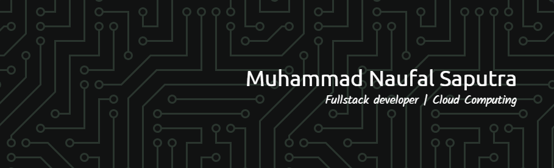

 
 
 
👋 Hi there, I’m Naufal! I’m an Information Systems student at Bina Sarana Informatika University (6th semester) with a strong interest in full-stack web development and digital product development.  🔧 Tech Stack:  Frontend: React.js, Next.js, Vue.js, HTML, CSS, JavaScript, TypeScript  Backend: Node.js, PHP, Express.js  Database: MySQL, MongoDB  🎓 Alumni Bangkit Academy 💼 Internship experience at PT. Kawan Kerja, currently interning at Bantu 🌱 Eager to learn more about SAP, enterprise systems, and scalable architectures 💡 Passionate about solving real-world problems with tech 📈 Actively looking for freelance opportunities and job openings in web development  📬 Let’s connect! Reach out via LinkedIn or email.

## 🌐 Socials:
   

# 💻 Tech Stack:
       
# 📊 GitHub Stats:
 
 

### 🔝 Top Contributed Repo

---

<!-- Proudly created with GPRM ( https://gprm.itsvg.in ) -->
